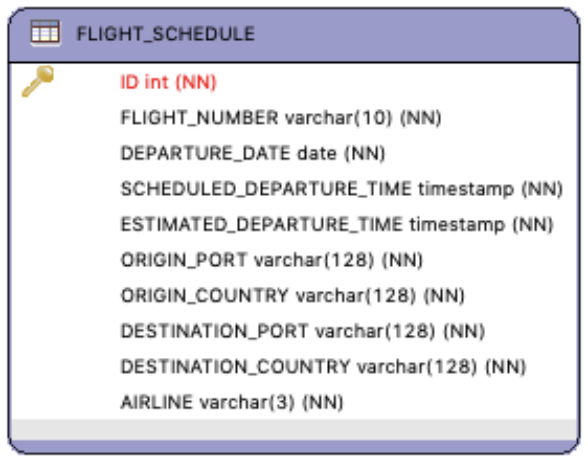

# Task

## Scenario
An airline has commissioned a new project to build a dashboard application which will assist
the flight operations centre get an understanding of “On Time Performance” in real time.
You’ve been tasked with designing and building a new microservice which will be the
backend for the new dashboard application.

### Constraints
- The current operational data store (ODS) is legacy, relational and shared. It is at
maximum capacity catering to APIs, batch ingest and report generation. As such, it
cannot be used for your application.
- NoSQL / Document store is the preferred storage mechanism for the new
application.
- Event Driven Architectures and Streaming are the preferred integration patterns.
- Java/Spring Boot/Docker are the preferred technology stack.
- You can use whichever message broker you wish.

### Deliverables
1. High level architecture diagram for moving data from the ODS into the new NoSQL store.
2. Design a JSON event schema to capture database changes from the ODS according to the ERD diagram provided.
3. Design a JSON event schema to capture business events that will be emitted by the new application e.g. FLIGHT_DELAYED.
4. Build a new micro service capable of:
a. Consuming database change events
b. Transforming them to a domain model
c. Storing into NoSQL
d. Detecting and publishing FLIGHT_DELAYED business events based on estimated departure time increasing by >15min of previous time.
5. Docker Compose file for any external dependencies i.e. message broker and NoSQL database.
6. Code checked into GitHub
7. A README file of how to run/test the application.

### Optional
8. Simple REST API to GET current status of a flight.

### Architectural Patterns:
- Change Data Capture (CDC)
- Command Query Responsibility Segregation (CQRS)
- Event Sourcing

### Sample ERD
